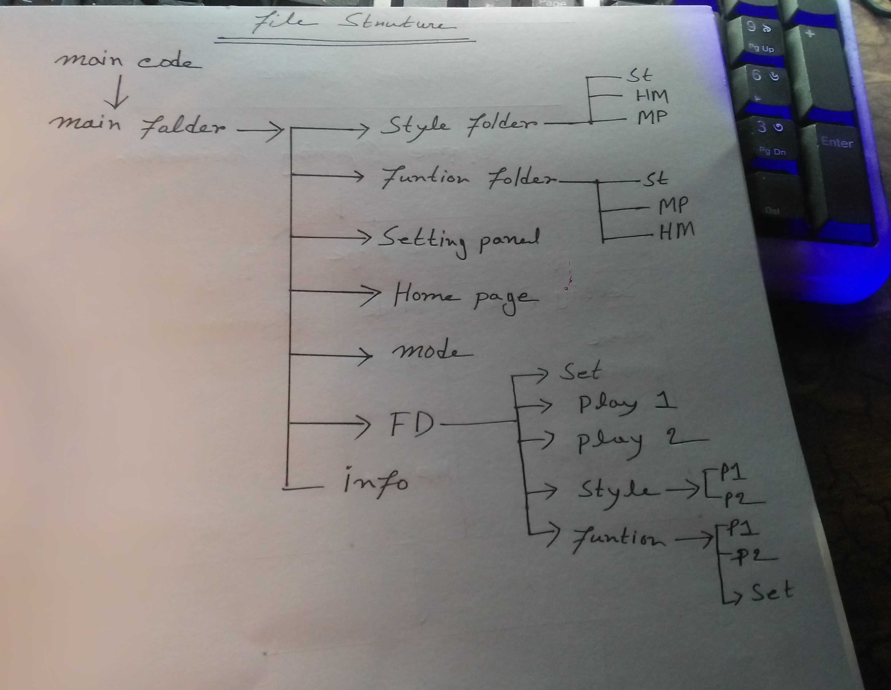

#### Uplode Date: 03 April 2026

# Chekers Game 🎮

A simple checkers game built using HTML, CSS, and JavaScript.

## Features 🚀

* Play with AI 🤖
* 2 Player Mode 👥
* Play With Hacker Ai
* King Promotion System 👑
* Multi Capture Support 🔥
* Smooth Game Interface 🎯

# Demo View
### Opening animation

### setting

### Home page

## Files structure 📂

## Technologies Used 🛠️

* HTML5
* CSS3
* JavaScript

## How to Run ▶️

1. Download or clone the repository
2. Open `game.html` in any browser

## Future Improvements 📌

* Better AI logic
* Sound effects
* Mobile optimization

##  Game Play Logic

Basic Rules

The game is played on an 8×8 board.

Only dark squares are used for movement.

Each player starts with 12 pieces.

Players move diagonally on dark squares only.

## Piece Movement
Normal pieces move one step diagonally forward.

Red player moves upward.

Black player (AI or Player 2) moves downward.

## Capturing

A piece captures an opponent by jumping diagonally over it.

The square behind the opponent piece must be empty.

Captured pieces are removed immediately.

## Multiple Capture

If another capture is available after one jump, the same piece continues capturing.

## King Promotion 👑

When a piece reaches the opponent’s last row, it becomes a King.

Kings can move diagonally in all directions.

## Mandatory Capture Rule

If a capture is possible, the player must capture.

## Winning Conditions 🏆

## A player wins when:

Opponent has no pieces left

Opponent has no valid moves

## AI Logic

## The AI:

Searches for available captures first

Prioritizes aggressive moves

Makes valid strategic moves automatically

Turn System

Select a piece

Highlight valid moves

Move piece

Capture if possible

Promote to king if reached end row

Switch turn
---

WhatsApp Number:  +880 1962-388570

